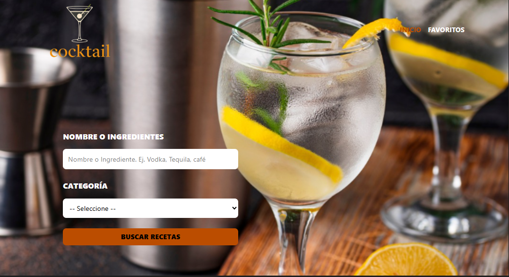

# 🍹 DrinksFinder - Buscador de Recetas de Bebidas

DrinksFinder es una aplicación web que permite a los usuarios explorar y descubrir **recetas de bebidas y cócteles** de manera rápida y sencilla.  
El proyecto está construido con **React + TypeScript**, implementa **Zustand** para el manejo global del estado y utiliza **Zod** para validar los datos obtenidos de la API en tiempo de ejecución.  

🔗 **Demo en vivo**: [https://drinks-finder-blush.vercel.app/](https://drinks-finder-blush.vercel.app/)  
🌐 **Portafolio**: [https://portfolio-drab-six-76.vercel.app/](https://portfolio-drab-six-76.vercel.app/)

---

## ✨ Características principales

- 🔍 Búsqueda de cócteles por **nombre** o **ingrediente**.  
- 📋 Visualización de detalles: ingredientes y pasos de preparación.  
- ⭐ Posibilidad de guardar recetas favoritas.  
- 🗂️ Estado global centralizado con **Zustand**.  
- ✅ Validación de datos recibidos desde la API con **Zod** para prevenir errores.  
- 📦 Tipado automático de datos gracias a `z.infer`.  
- ⚡ Interfaz moderna y responsiva con **TailwindCSS**.  
- 🌐 Consumo de API externa con **Axios**.  

---

## 🛠️ Tecnologías utilizadas

- **React 19** + **TypeScript**  
- **Vite**  
- **Zustand**  
- **Zod**  
- **TailwindCSS**  
- **Axios**  
- **React Router DOM**  
- **Heroicons** y **Lucide React**  

---

## 📸 Vista previa

